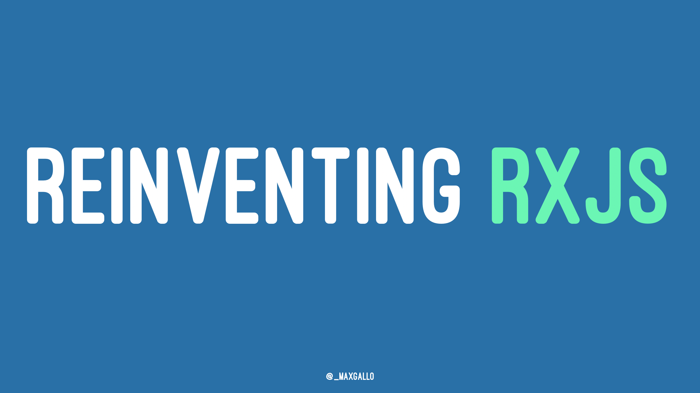

# Reinventing RxJS
Slides and example code of the talk

## Slides
The slides are available as _pdf_ [slides.pdf](slides.pdf) or _markdown_ [slides.md](slides.md)

## Live Coding
In the talk there is a live coding session.
"Before" is what we started with, and "after" is where we arrived.

### Live coding: RxJS
- before: [rxjs0.js](code/rxjs0.js)
- after: [rxjs1.js](code/rxjs1.js)

## Learn More
If you want to learn more about RxJS

- [Reactive Programming Introduction __André Stalz__](https://gist.github.com/staltz/868e7e9bc2a7b8c1f754)
- [Building Observables __Ben Lesh__](https://medium.com/@benlesh/learning-observable-by-building-observable-d5da57405d87)
- [Building yur own Observable __Todd Motto__](https://toddmotto.com/rxjs-observables-observers-operators)

## Tools
What I used for these slides

- Slides: [Deckset](https://www.decksetapp.com/)
- Draws: [draw.io](https://www.draw.io)
- Live Coding: Vim + [heaving configuration](https://github.com/maxgallo/dotfiles) + [nodemon](https://github.com/remy/nodemon) for hot reloading

