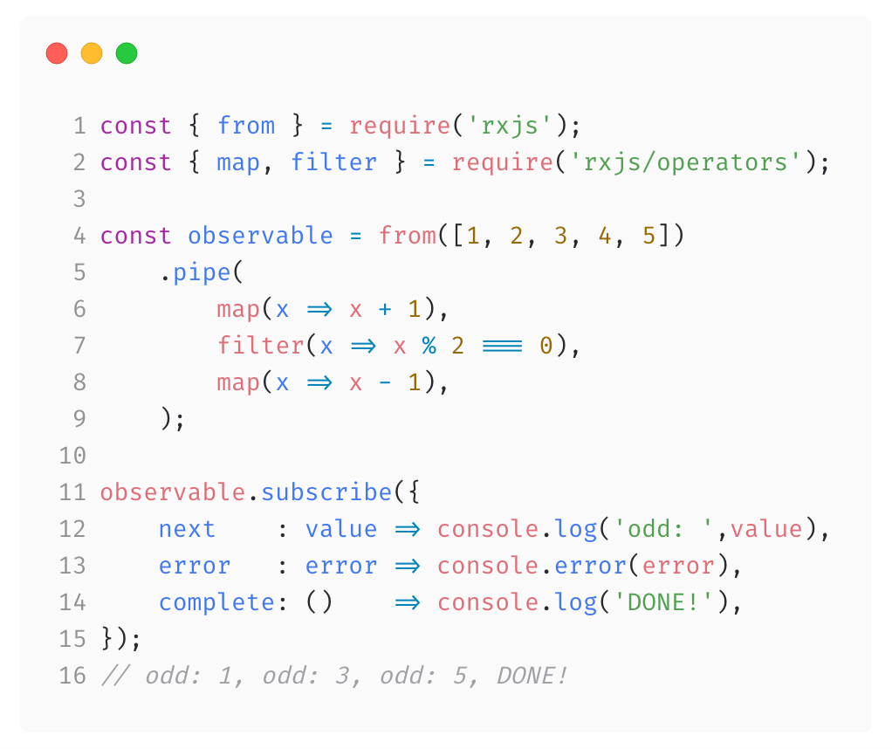

# [fit] Reinventing __RxJS__

[.footer: @_maxgallo ]
^ - rise your hand if you use RxJS in production

---

# Hi 👋🏻
#[fit] I'm __Max__ Gallo

_About me:_ 🍝 💻 🇬🇧 🎶 🏍 📷 ✈️ ✍️

_Principal Engineer_

_twitter:_ @\_maxgallo
_more:_ maxgallo.io

---

# Introducing __RxJS__

---

_Part of the_ Reactive X _Family_

> API for asynchronous programming
with observable streams

---

# [fit] Take
## [fit] things apart

## _and_

# __reinvent__
# __the wheel__

^ - This is me when I was six
- I like to understand things by taking them apart
- and watch inside to understand how they work

---

#[fit] Reinventing __RxJS__

---

---

[.build-lists: true]
# __RxJS__ code _first impressions_

 

- Syntax _is library specific_[^1]
- Explicit Subscription
- Observable _[TC39 stage 1](https://github.com/tc39/proposals#stage-1)_
- Pipeline operator _[TC39 stage 1](https://github.com/tc39/proposals#stage-1)_

[^1]: 👋 mutation observer

^ MutationObserver is a method for observing and reacting to changes to the DOM.
It's already available in many browser.

---

### 💡 _let's reinvent_ RxJS

---

# __RxJS__ Operators

 
 
 
 
 
 
         _Operator_ 1 _-->_> _Operator_ 2 _-->_> _Operator_ 3

---

[.build-lists: true]
# __RxJS__ *from the inside*

- _Made of_ reusable parts > **Streams**
- Standard contract _between parts_
- custom operators
- Lazy evaluation
- Synchronous _by default_ > **Schedulers**

<!--

---

# __RxJS *Deep Dive*__ Cold & Hot Observables

❄️ Cold Observable _The producer is inside the observer_ 

🔥 Hot Observable _The producer is outside the observer_

-->

---

#[fit] Deep Dive __Schedulers__

---

> Schedulers in RxJS are things that control _**the order of event emissions**_ (to Observers) and _**the speed of those event**_ emissions.
-- André Staltz

---

#[fit] __**Order**__ of event emissions
#[fit] __**Speed**__ of event emissions

---

__**Order _of event emissions_**__

#[fit] Queue __*/*__ Asap __*/*__ Async __*/*__ AnimationFrame

__**Speed _of event emissions_**__

# __*/*__ virtualtime __*/*__

---

# We made it 🙌

---

# __**>**__ Disassemble

### _Take things apart to understand what's going on_

--- 

# __**>**__ Reinvent

### _Build your own version_

---

# __**>**__ Learn
### _Build means learn_

---

# __**>**__ Share
### _Tell others what you did_

---

#[fit] Disassemble __*/*__ Reinvent __*/*__ Learn __*/*__ Share

_twitter_ @\_maxgallo
_other_ maxgallo.io

#[fit] Thank __you__ 🙏

_slides_ [github.com/maxgallo/talk-reinventing-rxjs](https://github.com/maxgallo/talk-reinventing-rxjs)

