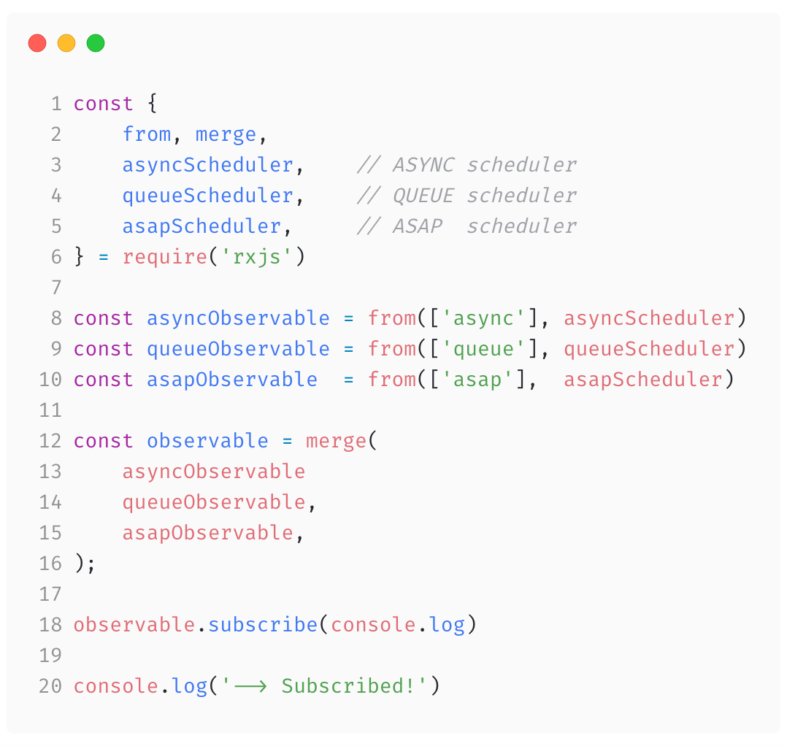
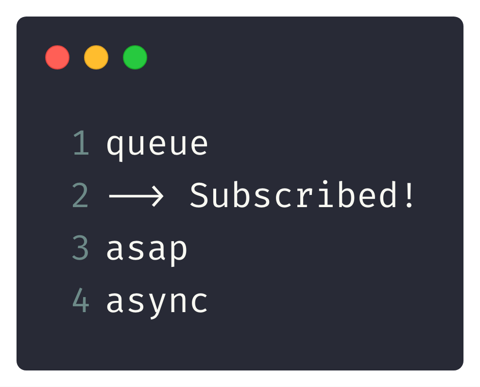

# [fit] Reinventing __RxJS__


[.footer: @_maxgallo ]
^ - rise your hand if you use RxJS in production

---


# 👋🏻👋🏻👋🏻
#[fit] __Max__ Gallo

🇮🇹 🇬🇧 🍝 💻  🎶 🏍 📷 ✈️ ✍️

_Principal Engineer_


_twitter:_ @\_maxgallo
_altro:_ maxgallo.io

---

[.build-lists: true]

#[fit] __Agenda__ di oggi
<br/>
  
1. _Introduzione_
- _Reinventiamo_ RxJS
- _Approfondimento_ Schedulers

---


# Introduzione

---

#[fit] Cosa e' __RxJS__ ?
<br/>

_Fa parte della famiglia_ Reactive X

> API for asynchronous programming
with observable streams

---


# [fit] Reinventare
## [fit] la ruota


# __smontando le cose__

^ - This is me when I was six
- I like to understand things by taking them apart
- and watch inside to understand how they work

---


#[fit] Reinventare __RxJS__

---


---

[.build-lists: true]
# __RxJS__ prime _impressioni_

<br/>

- Sintassi _> specifica della libreria_
- Subscription _> esplicita_
- Observable _[TC39 stage 1](https://github.com/tc39/proposals#stage-1)_
- Pipeline operator _[TC39 stage 1](https://github.com/tc39/proposals#stage-1)_

^ MutationObserver is a method for observing and reacting to changes to the DOM.
It's already available in many browser.

---

### 💡 _reinventiamo_ RxJS

---

# __RxJS__ Operators

<br />
<br />
<br />
<br />
<br />
<br />
         _Operator_ 1 _-->_> _Operator_ 2 _-->_> _Operator_ 3


---

[.build-lists: true]
# __RxJS__ *dall'interno*


- _Fatto di_ parti riusabili > **Streams**
- Contratto Standard _tra le parti_
- custom operators
- Lazy evaluation
- Sincrono _di default_ > **Schedulers**

<!--

---

# __RxJS *Deep Dive*__ Cold & Hot Observables

❄️ Cold Observable _The producer is inside the observer_ 

🔥 Hot Observable _The producer is outside the observer_

-->

---


#[fit] Approfondimento __Schedulers__

---

> _**Gli Schedulers in RxJS sono le cose che controllano**_ l'ordine di emissione degli eventi _**(agli Observers) e la**_ velocità di emissione degli eventi.
-- André Staltz

---

#[fit] __**Ordine**__ di emissione _**degli eventi**_
#[fit] __**Velocità**__ di emissione _**degli eventi**_

---



---


# __**Console**__




---


#[fit] Queue __*/*__ Asap __*/*__ Async __*/*__ AnimationFrame

---

```
                                requestAnimationFrame(task)
                                                 |
    Promise.resolve().then(task)                 |
                 |                               |
                 |                               |
```
#[fit] Queue __*/*__ Asap __*/*__ Async __*/*__ AnimationFrame

```
     |                        |                          
     |                        |                          
synchronous                   |                           
                              |                          
                   setInterval(task, delay)
```

---

__**ordine _di emissione degli eventi_**__

#[fit] Queue __*/*__ Asap __*/*__ Async __*/*__ AnimationFrame

<br/>
<br/>
<br/>

---

__**ordine _di emissione degli eventi_**__

#[fit] Queue __*/*__ Asap __*/*__ Async __*/*__ AnimationFrame

__**velocita' _di emissione degli eventi_**__

# __*/*__ virtualtime __*/*__

---


<br />

#[fit] __*Virtual Time*__ scheduler 


_(_ esempio 🙌 hands on _)_

---


# Ce l'abbiamo fatta 🙌

---

# __**>**__ Smonta

### _Guarda come funzionano le cose dentro_

--- 

# __**>**__ Crea

### _Creati la tua versione_

---

# __**>**__ Impara
### _Creare vuol dire imparare_

---

# __**>**__ Condividi
### _Racconta agli altri cosa hai fatto_

---

#[fit] Smonta __*/*__ Crea __*/*__ Impara __*/*__ Condividi


_twitter_ @\_maxgallo
_altro_ maxgallo.io

#[fit] __Grazie__ 🙏

[github.com/maxgallo/talk-reinventing-rxjs](https://github.com/maxgallo/talk-reinventing-rxjs)


